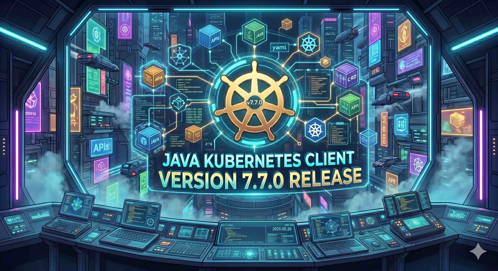

I am excited to share what's new in **Fabric8 Kubernetes Client v7.7.0** - another exciting release from the project.

This release brings Kubernetes v1.36 support, a powerful new server-side content negotiation feature that can dramatically reduce memory usage when listing resources, several developer-experience improvements, and over a dozen bug fixes including a critical leader election timing correction.

---

## What is Fabric8 Kubernetes Client?

For those unfamiliar, the [Fabric8 Kubernetes Client](https://github.com/fabric8io/kubernetes-client) is the most widely-used Java client library for interacting with Kubernetes and OpenShift clusters. It provides a fluent, type-safe API that lets Java developers create, read, update, delete, and watch Kubernetes resources - Pods, Services, Deployments, Custom Resources, and more - without wrestling with raw HTTP calls or hand-rolled JSON serialization.

The project is a foundational building block for frameworks like Quarkus, the Java Operator SDK (JOSDK), strimzi-kafka-operator, many Apache projects and countless enterprise applications running on Kubernetes or Red Hat OpenShift. When you write a Kubernetes operator in Java, or integrate your app with Kubernetes, there is a good chance Fabric8 is doing the heavy lifting underneath.

---

## What's New in v7.7.0

Let me walk you through the most significant changes in this release.

### Kubernetes v1.36 (Haru) Support

The headline addition in v7.7.0 is support for **Kubernetes v1.36**, codenamed *Haru*. This keeps Fabric8 aligned with the latest Kubernetes API surface, ensuring developers working on clusters running v1.36 have access to the newest resource types, API groups, and field-level changes without waiting on the library to catch up.

Staying current with upstream Kubernetes is one of the ongoing commitments of the project. Every new Kubernetes release brings API additions, deprecations, and sometimes breaking changes in the API spec itself - and it is the job of the client library to absorb those changes so application developers don't have to think about them.

### Server-Side Content Negotiation

This is the most significant new feature in v7.7.0 ([#7451](https://github.com/fabric8io/kubernetes-client/pull/7451)). The client now supports alternative resource representations via HTTP content negotiation using the `Accept` header. This enables two powerful response formats that the Kubernetes API server already supports but were previously inaccessible through Fabric8.

#### Why This Matters

Consider a common scenario: you need to list all Pods in a cluster to check their labels or annotations. A single Pod descriptor can easily exceed 50KB. When listing thousands of Pods, you are pulling down and deserializing megabytes of spec and status data that you never actually use. This wastes memory, network bandwidth, and CPU time on deserialization.

Server-side content negotiation solves this by letting you ask the API server to send back only the data you need.

#### PartialObjectMetadata - Lightweight Metadata-Only Responses

When you only need metadata (labels, annotations, owner references, names), you can now request `PartialObjectMetadata` responses that omit the `spec` and `status` fields entirely:

```java
try (KubernetesClient client = new KubernetesClientBuilder().build()) {

    // List only metadata for all Pods in a namespace
    PartialObjectMetadataList podMetadata = client.pods()
        .inNamespace("production")
        .listAsPartialObjectMetadata();

    for (PartialObjectMetadata meta : podMetadata.getItems()) {
        System.out.println("Pod: " + meta.getMetadata().getName());
        System.out.println("Labels: " + meta.getMetadata().getLabels());
        System.out.println("Created: " + meta.getMetadata().getCreationTimestamp());
    }
}
```

You can combine this with label selectors and list options for targeted queries:

```java
// Get metadata for Pods matching a label selector
PartialObjectMetadataList webPods = client.pods()
    .inNamespace("production")
    .withLabel("app", "web")
    .listAsPartialObjectMetadata();

// Get metadata for a single resource by name
PartialObjectMetadata singlePod = client.pods()
    .inNamespace("production")
    .withName("web-server-abc123")
    .getAsPartialObjectMetadata();
```

This is particularly useful for informers watching large numbers of resources where you only need to track metadata changes rather than full resource state.

#### Table Format - Tabular Responses Like kubectl

The Table format returns a `meta.k8s.io/v1/Table` object with server-defined column definitions and rows - the same format that `kubectl` uses when displaying resources. This is useful for building CLI tools and dashboards that need tabular resource presentation:

```java
// Get a tabular view of Deployments
Table deploymentTable = client.apps().deployments()
    .inNamespace("default")
    .listAsTable();

// Print column headers
List<TableColumnDefinition> columns = deploymentTable.getColumnDefinitions();
for (TableColumnDefinition col : columns) {
    System.out.printf("%-20s", col.getName());
}
System.out.println();

// Print rows
for (TableRow row : deploymentTable.getRows()) {
    for (Object cell : row.getCells()) {
        System.out.printf("%-20s", cell);
    }
    System.out.println();
}
```

Both formats are available through new fluent DSL methods (`listAsTable()`, `listAsPartialObjectMetadata()`, `getAsPartialObjectMetadata()`) that integrate seamlessly into the existing API without breaking any generic type contracts.

### HasMetadata#isSameResource - Resource Identity Comparison

A new utility method `isSameResource` ([#7426](https://github.com/fabric8io/kubernetes-client/pull/7426)) has been added to the `HasMetadata` interface, allowing you to test whether two Kubernetes resource objects represent the same logical resource.

This is a deceptively subtle problem. Two Pod objects might have been fetched at different times, through different API versions, or from different informer caches. Comparing them with `equals()` fails because the spec or status has changed between fetches. What you actually want to know is: *do these objects refer to the same resource?*

```java
Pod podFromInformer = informerCache.get("my-pod");
Pod podFromApiServer = client.pods()
    .inNamespace("default")
    .withName("my-pod")
    .get();

// Check if they refer to the same resource
if (podFromInformer.isSameResource(podFromApiServer)) {
    System.out.println("Same resource, potentially different versions");
}

// Strict mode: also compares UIDs when available
if (podFromInformer.isSameResource(podFromApiServer, true)) {
    System.out.println("Same resource with matching UIDs");
}
```

The method checks kind, namespace, and name for identity. In strict mode, when UIDs are present on both objects, the UID comparison takes precedence - following the Kubernetes convention that an object's identity should not depend on the API version.

This is especially valuable in operator and controller code where you frequently need to correlate resources across different data sources.

### ResourceEventHandler.onList - Improved Event Handling

The `ResourceEventHandler` interface now includes an `onList` method ([#7550](https://github.com/fabric8io/kubernetes-client/pull/7550)), replacing the deprecated `onNothing` method.

The old `onNothing` was very narrowly scoped - it only fired in test conditions when no events were emitted after a list operation. The new `onList` generalizes this to consume any listing event, enabling faster cache cleanup in operator frameworks and providing a hook for responding to list synchronization events regardless of whether they arrive through standard watches or non-watch list operations:

```java
SharedIndexInformer<Pod> informer = client.pods()
    .inNamespace("default")
    .inform(new ResourceEventHandler<>() {
        @Override
        public void onAdd(Pod pod) {
            System.out.println("Added: " + pod.getMetadata().getName());
        }

        @Override
        public void onUpdate(Pod oldPod, Pod newPod) {
            System.out.println("Updated: " + newPod.getMetadata().getName());
        }

        @Override
        public void onDelete(Pod pod, boolean deletedFinalStateUnknown) {
            System.out.println("Deleted: " + pod.getMetadata().getName());
        }

        @Override
        public void onList(List<Pod> list) {
            // Called after a list sync completes
            System.out.println("List synced, total resources: " + list.size());
        }
    });
```

---

## Improvements

### Self-Signed Certificate SANs

Self-signed certificate generation now includes **Subject Alternative Names** (SANs) ([#3396](https://github.com/fabric8io/kubernetes-client/issues/3396)). This is a long-standing issue - modern TLS implementations require SANs for hostname validation, and certificates without them cause connection failures in many environments. The fix ensures that test and development certificates generated by Fabric8 work correctly across all modern TLS stacks.

### MockWebServer HTTP/2 Control

The `MockWebServer` gains a `setHttp2ClearTextEnabled()` setter ([#7662](https://github.com/fabric8io/kubernetes-client/pull/7662)) for opting out of HTTP/2 h2c (cleartext) negotiation. This is useful in testing scenarios where you need to force HTTP/1.1 behavior or when your test environment does not support h2c upgrades.

### CRD Generator Maven Plugin Toolchain Awareness

The `crd-generator-maven-plugin` is now toolchain-aware ([#6923](https://github.com/fabric8io/kubernetes-client/issues/6923)), meaning it can use a specific JDK configured through Maven toolchains rather than always using the JDK running Maven itself. This is important for projects that build against multiple Java versions or use a different JDK for compilation versus runtime.

---

## Critical Bug Fixes

This release addresses 14 bug fixes, several of which resolve subtle but serious issues. Here are the most impactful ones:

### Leader Election Timing Fix

**The most critical fix in this release** ([#7350](https://github.com/fabric8io/kubernetes-client/issues/7350)): The leader election callback timing has been corrected to prevent **dual-leader scenarios**. In the previous behavior, under certain timing conditions, the renew cycle and leadership transition callbacks could overlap in a way that allowed two instances to both believe they held the lease. In operator deployments relying on leader election for singleton semantics, this could lead to duplicate reconciliation, conflicting writes, and data corruption. If you use Fabric8's leader election in production, this fix alone is reason to upgrade.

### MockWebServer Shutdown Race Condition

The `MockWebServer` shutdown sequence has been linearized ([#7747](https://github.com/fabric8io/kubernetes-client/issues/7747)) to eliminate a race condition that caused `RejectedExecutionException` during test teardown. While this only affects test code, flaky test failures caused by this race condition were difficult to diagnose and could mask real test failures.

### Exec WebSocket Exit Code Handling

Two fixes ([#7700](https://github.com/fabric8io/kubernetes-client/issues/7700), [#7695](https://github.com/fabric8io/kubernetes-client/issues/7695)) correct the `ExecWebSocketListener` to properly preserve parsed exit codes. The listener now defers failure handling and exit code completion through the `SerialExecutor`, ensuring that the exit code is reliably available to callers even when the exec stream completes quickly or encounters errors.

### Informer Cache Index Fix

Ephemeral index entry removal from informer caches has been fixed ([#7265](https://github.com/fabric8io/kubernetes-client/issues/7265)). Stale index entries could accumulate over time, leading to incorrect lookups and increased memory usage in long-running informers.

### Recursive Inline Schema Resolution

The java-generator now correctly resolves recursive nested inline embed fields ([#7543](https://github.com/fabric8io/kubernetes-client/issues/7543)). Previously, deeply nested inline schemas in CRD definitions could cause incorrect code generation or infinite recursion during the generation phase.

### HTML-Safe Javadoc in CRD Descriptions

The java-generator now HTML-escapes special characters in CRD descriptions ([#7632](https://github.com/fabric8io/kubernetes-client/issues/7632)), producing valid Javadoc. CRD descriptions containing `<`, `>`, or `&` characters previously generated Javadoc that failed to parse or rendered incorrectly in IDEs.

---

## Breaking Changes

This release includes several breaking changes driven by upstream Kubernetes ecosystem updates:

- **`scheduling.k8s.io/v1alpha1`** classes have been removed following the upstream workload scheduling rearchitecture
- **Cluster-API** model classes moved to `io.fabric8.kubernetes.api.model.clusterapi.core.v1beta1`
- **Cert-manager** `ObjectReference` has been renamed to `IssuerReference`
- **Gateway-API** v1beta1 `ReferenceGrant` classes removed (graduated to v1)
- **Knative** internal autoscaling field removed
- **Kustomize** `Patch.options` type changed to `PatchArgs`
- **Monitoring** model classes removed and `ThanosSpec` field types updated
- **Open-cluster-management** `WebhookConfiguration` removed

Most of these reflect upstream API graduations and removals. If you are using extension model classes from any of these projects, check the specific API group changes before upgrading.

---

## Dependency Upgrades

Notable dependency updates in this release include:

- **Istio** 1.29.1
- **Jackson** 2.21.1
- **Prometheus Operator** 0.91.0
- **Knative** 0.49.0
- **Vert.x** 5.0.12

---

## Using Fabric8 in Your Projects

### Adding the Dependency

For **Maven**, add the following to your `pom.xml`:

```xml
<dependency>
    <groupId>io.fabric8</groupId>
    <artifactId>kubernetes-client</artifactId>
    <version>7.7.0</version>
</dependency>
```

For **Gradle**:

```groovy
implementation 'io.fabric8:kubernetes-client:7.7.0'
```

If you're working with **OpenShift** and need access to OpenShift-specific resources like Routes, BuildConfigs, or ImageStreams:

```xml
<dependency>
    <groupId>io.fabric8</groupId>
    <artifactId>openshift-client</artifactId>
    <version>7.7.0</version>
</dependency>
```

### Quick Start

```java
try (KubernetesClient client = new KubernetesClientBuilder().build()) {

    // Full resource listing
    PodList pods = client.pods().inNamespace("default").list();

    // Lightweight metadata-only listing (new in v7.7.0)
    PartialObjectMetadataList metadata = client.pods()
        .inNamespace("default")
        .listAsPartialObjectMetadata();

    // Tabular output like kubectl (new in v7.7.0)
    Table table = client.pods()
        .inNamespace("default")
        .listAsTable();
}
```

The builder automatically discovers configuration from your environment in priority order: system properties, environment variables, kubeconfig file, and then in-cluster service account credentials. If you are running inside a Kubernetes Pod, it just works with no additional setup.

---

## Wrapping Up

Fabric8 Kubernetes Client v7.7.0 is a feature-rich release. Kubernetes v1.36 alignment keeps the library current, server-side content negotiation opens up significantly more efficient resource listing patterns, and the leader election timing fix addresses a critical correctness issue for operator deployments.

The `PartialObjectMetadata` and `Table` response support is the kind of feature that can materially change how you build monitoring tools, dashboards, and operators - fetching only what you need instead of deserializing full resource payloads saves memory, bandwidth, and CPU at scale.

If you are building Java applications that talk to Kubernetes or OpenShift, give v7.7.0 a try. The [repository is here](https://github.com/fabric8io/kubernetes-client) and the community is ready to help you get started.
