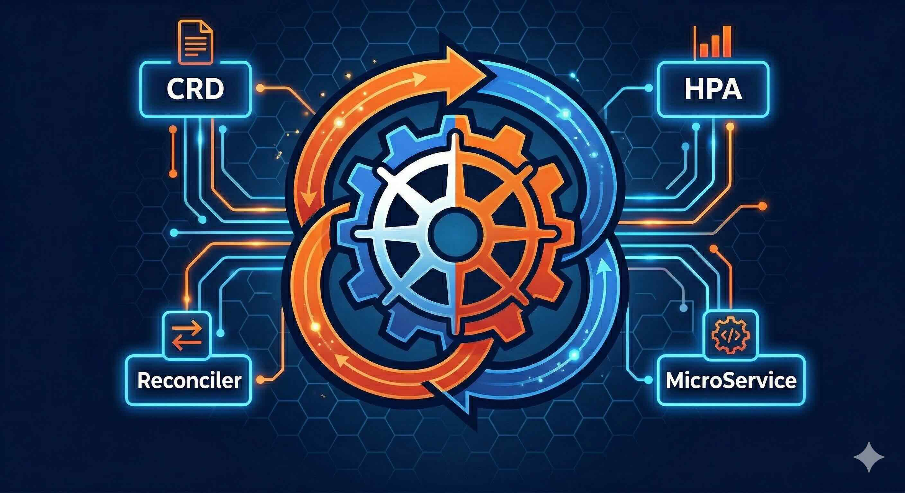

On March 28th, I stood in front of a room full of developers at the **FOSS United Pune meetup** at the Red Hat Pune office and talked about something I genuinely care about: building Kubernetes operators in Java using the [Java Operator SDK (JOSDK)](https://github.com/operator-framework/java-operator-sdk).

It was my first public talk in the open source community. I want to write about it - both the technical content and what the experience felt like - because I think both parts are worth sharing.

---

## How I Got Here

I am a Senior Software Engineer at Red Hat, and I work upstream on the [Fabric8 Kubernetes Client](https://github.com/fabric8io/kubernetes-client) - the most widely used Java client for interacting with Kubernetes and OpenShift clusters. Fabric8 is what powers JOSDK under the hood, so the two projects are closely related. When you write a Java operator using JOSDK, Fabric8 is doing all the Kubernetes API communication for you.

I have spent a lot of time contributing to Fabric8 and watching how JOSDK sits on top of it. At some point I wanted to tell that story to a wider audience. FOSS United Pune gave me the opportunity.

Honestly, preparing for the talk was more work than I expected. Standing up in front of a community meetup is different from anything I had done before. You have to think about what people already know, what you can reasonably explain in 30–40 minutes, and how to make something as abstract as the operator pattern feel concrete. Writing slides forced me to articulate things I had only ever thought about implicitly.

---

## What is the Operator Pattern?

Before diving into JOSDK specifically, it is worth stepping back and asking: what problem are operators solving?

Kubernetes is great at managing the lifecycle of well-understood workloads - stateless applications, simple deployments, rolling updates. But real software systems have operational knowledge baked into them. A database cluster has a specific bootstrap sequence. A message broker needs particular configuration when replicas join or leave. A microservice stack might require coordinated rollouts across multiple dependent components.

Kubernetes itself cannot know all of these things. The operator pattern is how you encode that domain-specific operational knowledge into Kubernetes itself.

An operator is just a Kubernetes controller - a process running in the cluster - that watches custom resources (CRDs) you define and continuously reconciles the actual state of the cluster toward the desired state you describe. It is the same pattern Kubernetes uses internally for its own resources, just extended for your own application domain.

The concept was introduced by CoreOS in 2016. Since then the ecosystem has matured significantly. Operators are now a standard way to package and distribute complex stateful applications on Kubernetes.

---

## Why Java? Why JOSDK?

The dominant operator framework for a long time has been [Operator SDK](https://sdk.operatorframework.io/) for Go. Most of the tooling, documentation, and community examples assume Go. If you are starting a greenfield project with no language constraints, Go is a reasonable default.

But that is not the reality for a lot of teams. Java has enormous penetration in enterprise software. If your organization runs a microservices platform built on Spring Boot or Quarkus, your developers already know Java. Asking them to context-switch to Go to write infrastructure tooling is a real cost.

This is the gap JOSDK fills. It gives Java developers a first-class, production-ready framework for building Kubernetes operators without leaving the JVM ecosystem.

JOSDK is not a toy. It is used in production operators across the Red Hat ecosystem and beyond. Projects like [Strimzi](https://strimzi.io/) (Kafka on Kubernetes) use Fabric8, which underpins JOSDK. The framework handles the hard parts of operator development - event queuing, retry logic, informer lifecycle management, leader election, and more - so you can focus on the reconciliation logic specific to your domain.

---

## The Core Abstraction: The Reconciler

The heart of JOSDK is the `Reconciler` interface. If you understand this one concept, you understand 80% of how operators work.

```java
@ControllerConfiguration
public class MicroServiceReconciler implements Reconciler<MicroService> {

    @Override
    public UpdateControl<MicroService> reconcile(MicroService resource, Context<MicroService> context) {
        // Your logic goes here.
        // Examine the desired state (resource.getSpec())
        // Compare with actual cluster state
        // Create, update, or delete dependent resources
        // Return whether to update the primary resource
    }
}
```

The reconciler is intentionally simple. JOSDK calls your `reconcile` method whenever the state of the world changes - when someone creates or updates your custom resource, when a dependent resource it manages changes, or on a configured periodic interval. Your job is to look at what is and make it match what should be. That is the entire contract.

This declarative, level-triggered model is what makes operators resilient. You do not write event handlers that fire once and assume success. You write logic that can be called repeatedly and always drives toward the correct state. If a reconciliation fails partway through, JOSDK retries it. If the cluster is temporarily unreachable, your operator catches up when it comes back.

---

## The Demo: MicroService Operator

For the live demo I built a production-grade example operator called [microservice-operator](https://github.com/ash-thakur-rh/microservice-operator). The goal was to show a realistic operator that does something meaningful - not just the canonical "hello world" counter example.

The operator introduces a single custom resource called `MicroService`. This CRD captures everything you need to declare a complete application stack:

```yaml
apiVersion: example.io/v1
kind: MicroService
metadata:
  name: my-app
spec:
  image: my-app:latest
  replicas: 2
  exposed: true
  autoscaling:
    minReplicas: 2
    maxReplicas: 10
    targetCPUUtilizationPercentage: 70
  database:
    image: postgres:15
    storageSize: 1Gi
```

When you apply this to a cluster, the operator reconciles the following:

**Always created:**
- A `ConfigMap` with application configuration
- A `Deployment` running your application container
- A `ClusterIP` `Service` exposing the deployment within the cluster

**When `spec.database` is configured:**
- A `Secret` with generated database credentials
- A `StatefulSet` running the database
- A `PersistentVolumeClaim` for database storage
- `Service` resources for the database

**When `spec.autoscaling` is configured:**
- A `HorizontalPodAutoscaler` targeting the application deployment

**When `spec.exposed: true`:**
- An `Ingress` (or OpenShift `Route`) exposing the service externally

All of these dependent resources are created with owner references back to the `MicroService` resource. This means when you delete the `MicroService`, Kubernetes automatically garbage-collects everything it owns. No manual cleanup. No orphaned PVCs.

### Dependent Resources in JOSDK

One of the things I wanted to highlight in the demo is how JOSDK models this multi-resource management cleanly using the concept of **dependent resources**.

Rather than writing one massive reconciler method that conditionally creates and updates every resource, JOSDK lets you declare each dependent resource as a separate class:

```java
@ControllerConfiguration(
    dependents = {
        @Dependent(type = ConfigMapDependentResource.class),
        @Dependent(type = DeploymentDependentResource.class),
        @Dependent(type = ServiceDependentResource.class),
        @Dependent(type = DatabaseDependentResource.class,
                   activationCondition = DatabaseActivationCondition.class),
        @Dependent(type = HPADependentResource.class,
                   activationCondition = HPAActivationCondition.class),
        @Dependent(type = IngressDependentResource.class,
                   activationCondition = ExposedActivationCondition.class),
    }
)
public class MicroServiceReconciler implements Reconciler<MicroService> { ... }
```

Each dependent resource class knows how to build its desired state from the primary `MicroService` spec. JOSDK handles calling them in the right order, checking whether they need to be created or updated, and wiring up the reconciliation lifecycle.

Activation conditions let you declare conditionally-created resources cleanly - `DatabaseActivationCondition` simply checks whether `spec.database` is set. The framework skips creation (and handles deletion) automatically.

This approach keeps each piece of logic small and testable. You can write a unit test for `DeploymentDependentResource` in isolation without spinning up a full cluster.

---

## What I Covered in the Talk

The session was structured around three questions:

**1. Why operators?**
Walking through the motivation - what operational knowledge looks like, why Kubernetes needs a way to encode it, and where the operator pattern fits in the broader ecosystem.

**2. Why JOSDK for Java teams?**
The case for JOSDK over other approaches: full Java ecosystem integration, mature testing support, Fabric8 underneath for Kubernetes API access, and active upstream community. I also talked briefly about my work on Fabric8 and how the two projects relate.

**3. Live demo**
Applying the `MicroService` CRD to a live cluster and watching the operator provision a full application stack in real time. Seeing all the resources appear in `kubectl get all` after a single `kubectl apply` is a good way to make the value tangible.

The FOSS United audience had a mix of backgrounds - some Kubernetes-heavy, some more application-developer focused. I tried to pitch the content so that someone unfamiliar with operators could follow the motivation, while still giving enough depth that people already using operators would find the JOSDK angle useful.

---

## What It Felt Like

I want to be honest about this part.

I was nervous. Not "going to forget everything" nervous, but genuinely anxious in a way I did not fully anticipate. I had run through the demo a dozen times at home. The slides felt solid. But standing at the front of the room with a live cluster open on screen is different from rehearsing at your desk.

The demo cooperated, which helped. Watching the operator create all the resources live - StatefulSet, Services, HPA, the whole stack - in front of people who could see it happening in real time was the moment where the room became most engaged. The highlight was the HPA demo: I simulated traffic load against the deployed `MicroService`, and the replicas automatically scaled up to 8 - driven entirely by the `HorizontalPodAutoscaler` the operator had provisioned. Seeing the replica count climb in real time made the value of the operator pattern click for a lot of people in the room. That is something you cannot really replicate in slides.

The Q&A afterward was the part I enjoyed most. People asked about leader election for HA operator deployments, how JOSDK handles rate limiting on reconcile loops, and whether JOSDK supports server-side apply. Good questions. The kind that tell you people were actually thinking about using this, not just passively watching.

One thing I want to improve for next time: I was a little rushed in the middle section where I covered dependent resources. It is the most powerful concept in JOSDK and I think I moved through it too quickly to give people time to absorb it. More code on screen, fewer words.

---

## FOSS United

A note on the venue itself: [FOSS United](https://fossunited.org/) does good work. Their Pune chapter runs regular meetups that cover a genuinely diverse range of topics - not just web development or AI, but infrastructure, systems programming, open source tooling, and community building. The audience is engaged and technical.

If you are in Pune and have something worth sharing, I would encourage you to propose a talk. The community is welcoming, the format is informal enough that you do not need a polished conference presentation, and the feedback you get from a room of people who can ask you real questions is invaluable.

---

## Resources

Everything from the talk is publicly available:

- **JOSDK**: [javaoperatorsdk.io](https://javaoperatorsdk.io) | [GitHub](https://github.com/operator-framework/java-operator-sdk) | [Docs](https://javaoperatorsdk.io/docs/)
- **Fabric8 Kubernetes Client**: [GitHub](https://github.com/fabric8io/kubernetes-client)
- **Demo project**: [microservice-operator](https://github.com/ash-thakur-rh/microservice-operator)

If you are thinking about building a Kubernetes operator in Java, start with the JOSDK docs and the official sample operators in the repo. The framework has excellent getting-started material and the community on GitHub is responsive.

And if you were at FOSS United Pune and have follow-up questions - reach out on [Twitter](https://twitter.com/ashish___thakur) or [LinkedIn](https://linkedin.com/in/ashish-thakur111). Happy to dig into specifics.